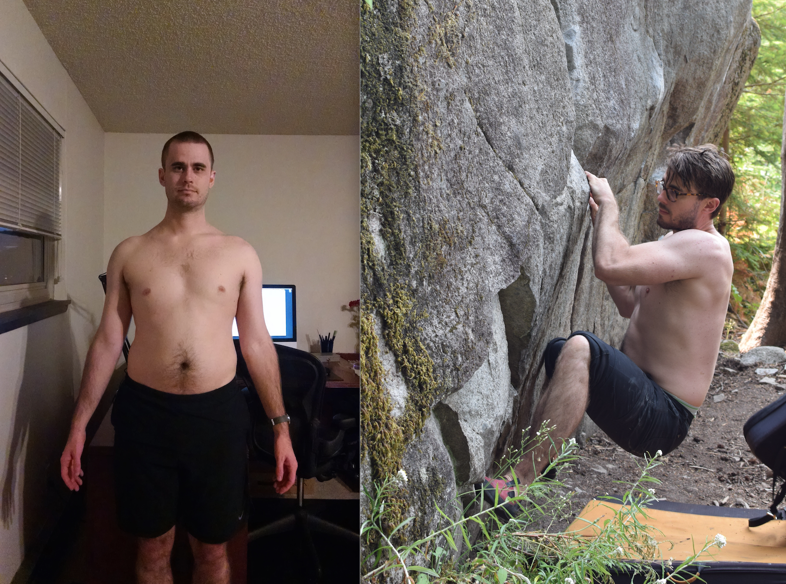

# A Weightlifting Routine for Software Engineers

  * [Introduction](#introduction)
  * [The Routine](#the-routine)
  * [Details on the Routine](#details-on-the-routine)
  * [Why this Routine is Good for Software Engineers](#why-this-routine-is-good-for-software-engineers)
  * [General Notes](#general-notes)

## Introduction

Recently, I took my buddy Anthony, a Google engineer and beginner weightlifter, through my current gym routine and was pleasantly surprised to find out that the routine had become quite refined as a “good bang for your buck” program to prevent injuries and counteract bad posture from repetitive computer use. He’s been raving about the life-changing magic of Face Pulls since.

It has taken me a few years to get here because so much of the advice online is geared toward maximizing bodybuilding or powerlifting results rather than balancing effort in the gym with serious knowledge work. Most software engineers aren’t looking to obsess about deadlift numbers or start a side business as an underwear model. We want our bodies to feel good for long hacking sessions, not worn out from marathon gym sessions.

The major thrust of this routine is to counteract the main contributors of bad posture from computer use: bad shoulder position, poor hip extension, low core stability, and weak upper back muscles while avoiding common training pitfalls that would harm posture. Weightlifting is by far the best training modality that I have found to address these things, being both time-efficient and highly effective.

Personally, I have problems with elbow tendonitis and shoulder tightness (too much tennis and Starcraft growing up). I’ve gradually experimented with different approaches to mitigating these symptoms. With this routine I manage to have virtually zero symptoms, often feeling quite good in my neck and shoulders, something that I didn’t think was possible for many years.

Anyway, I thought that I’d write it down as a snapshot of my current thinking on this stuff. Take it all with a grain of salt: I’m not a health professional and bodies vary a lot from person to person. The ideas here have worked well for me and maybe they can inspire the design of your own program.

While the point of introducing weightlifting into an engineer's routine isn't dramatic physical transformation, a post like this wouldn't be complete without some gratuitous before and after pictures. Here are some of mine:

## The Routine

I run this routine as a two-day per week program, alternating between A and B workouts.

| A                                                                                    | B                                                                   |
|--------------------------------------------------------------------------------------|---------------------------------------------------------------------|
| Max triple [Trap Bar Deadlift](https://youtu.be/TU2xZ7s4jus?t=195)  Superset: [Band Kickbacks](https://www.youtube.com/watch?v=rONpWaNIhE8)                         | 3x5 Goblet [Rear-Elevated Split Squats](https://www.t-nation.com/training/bulgarian-split-squats)  Superset: [X-Band Walks](https://youtu.be/OhOe6yA_zYk?t=359) |
| 5x5 [Dips](https://youtu.be/vi1-BOcj3cQ)  Giant set: [Band shoulder dislocations](https://youtu.be/2GG4Qi5whnA?t=109) Giant set: [Band pull-aparts](https://youtu.be/OhOe6yA_zYk?t=42https://youtu.be/OhOe6yA_zYk?t=42) | Same as A                                                           |
| 3x5 [Chin-Ups](https://youtu.be/sIvJTfGxdFo?t=220)                                                                         | Same as A                                                           |
| 3x10 [Face pulls](https://www.youtube.com/watch?v=eIq5CB9JfKE)                                                                      | Same as A                                                           |
| [7 minutes abs](https://www.youtube.com/watch?v=DHD1-2P94DI)                                                                        | Same as A                                                           |
| 10 minutes conditioning                                                              | Same as A                                                           |

“3x5” means do 3 sets of 5 repetitions each. Rest as long as needed between each set, usually one to three minutes.

The links in the table are to videos on technique for the movements. I encourage you to do your own research as well since no single video is perfect.

You can run this as a three-day per week program by repeating the B workout (doing deadlifts more than once a week is usually too tiring), just make sure you’re eating enough to support recovery.

## Details on the Routine

### Max triple Deadlift 

A max triple means you work your way up to lifting as much weight as you can for three repetitions. I usually end up doing around six sets total.

If your gym has a trap bar use that. It is less technical than a conventional deadlift and it allows for a neutral shoulder position rather than the internally rotated position of the conventional deadlift.

### Superset: Band Kickbacks

“Superset” means to perform the exercise immediately after the previous exercise before taking a rest between sets.

Try to feel the band kickbacks in your upper glutes. 

I usually do ten reps per set, aiming for quality, controlled movement.

### 3x5 Goblet Rear-Elevated Split Squats

The goblet variation means you hold a dumbbell cupped in two hands in front of you against your chest. Use as much weight as makes 3x5 difficult. 

And it’s 3x5 each leg.

### Superset: X-Band Walks

Like the kickbacks, you’re aiming to feel this in your upper glutes. It’s a little trickier with this move.

### 5x5 Dips

Add weight if you can do the repetitions.

You can substitute 3x10 Incline Dumbbell Press if you can’t do these.

### Giant set: Band shoulder dislocations
### Giant set: Band pull-aparts

“Giant set” means the same thing as “Superset” except it’s multiple exercises, all performed one after the other.

The band exercises aren’t meant to be hard; they’re meant to prime good movement patterns. Watch technique videos carefully for these movements and work hard to feel the movement in the right muscles (your back, not your shoulders, basically).

### 3x5 Chin-Ups

I can only do five chin-ups in a set. Do up to 3x10. If you can do more than ten in a set, add weight.

I prefer chin-ups to other pull-up variations because they have the most bicep engagement.

You can substitute 3x10 Lat Pulldowns or 3x10 Bodyweight Rows if you can’t do these.

### 3x10 Face pulls

This movement is one of the most valuable in the routine for posture but also the hardest to get right. Watch the linked video very carefully. The tip to use two ropes is a really good one.

### 7 minutes abs

Any ab work would be fine here (except high repetition crunches; those are useless). I like the linked 7 minute routine. 

### 10 minutes conditioning

Anything that raises your heart rate and kind of sucks is good here. This block is also a chance to sneak in one last accessory movement for problem areas. For example, kettlebell swings to work on hip opening. Here are some things I cycle between:

* 10 minutes of rowing
* 10 minutes of assault bike
* 10 minutes of swimming
* 100 kettlebell swings
* 50 D-Ball cleans then 100 double unders

## Why this Routine is Good for Software Engineers

Almost every one of the movements in this routine counteracts some element of bad posture from computer use like bad shoulder position, poor hip extension, low core stability, and weak upper back muscles while avoiding common training pitfalls that would harm posture.

Shoulder positioning is a deep topic because of the complex biomechanics of the shoulder joint (more accurately the “shoulder complex”). Oversimplifying, software engineers generally want to avoid moves that “turn your shoulders inward” (internal rotation) because you spend so much time in this position at a desk. Many of the movements use or encourage neutral or external rotation instead of internal rotation. Keep an eye out for this happening to your shoulders while lifting, as your body may be so used to this position that it feels more comfortable. One way to learn what good shoulder positioning feels like is to practice rehab movements like [wall slides](https://youtu.be/zsmeXwHu6W0?t=164).

Shoulder positioning is also why the upper body pushing work in this routine is purposefully light. That is, there isn’t a bunch of benching or chest isolation exercises. This is because these sorts of movements exacerbate internal rotation of the shoulders by tightening the muscles of the chest.

The final element of shoulder positioning this routine addresses is upper back strength. Strengthening the muscles of the upper back make it easier to sit up straight. The upper back has a ton of muscles so we use multiple movements to hit it different ways. The goblet variation of split squats is challenging on your upper back. Face pulls target little muscles like rear delts that are hard to hit otherwise. The upper body band exercises fit in here, too.

Hip flexion is the other major theme of this routine. At a computer, you sit in hip flexion for long periods of time. This “turns off” your glutes and tightens up the muscles that allow your legs to swing naturally behind you (your hip flexors). One way you’ll see this expressed is in “anterior pelvic tilt”, where your hips tip forward and your butt sticks out. Besides it not being a good look, this hip positioning has cascading effects on your shoulder and neck positioning, potentially causing shoulder and neck pain. In other words, your hips might be responsible for your neck pain! Movements like Band Kickbacks, Split Squats, and Deadlifts counteract this effect. 

By the way, I spent many years trying to improve my hips and shoulders with stretching and “mobility work” like foam rolling to little avail. I found that weightlifting actually worked. Stretching won’t strengthen the weak muscles that lead you to get tight in the first place (e.g. your weak upper back that causes your head to droop at a desk, making your shoulders tight). Further, there seems to be a difference between the body’s ability to stretch in a static (not moving) position and a dynamic (moving) position. Note that you should still warm up in the gym to prevent injuries: perform lighter versions of the exercises you’re about to do until you feel ready. 

## General Notes

Another principle at work in this routine is to use “idiot-proof” movements as much as possible: it shouldn’t be too hard to get the majority of the benefit of a movement, even when you’re tired or imperfect with technique. Technical movements like Back Squats and Bench Press have their place, but I find them too easy to perform incorrectly, hitting the wrong muscles or using dangerous technique to get the weight up.

This routine strikes a balance between a pure strength routine and a bodybuilding routine. I think working up to heavy lifts in leg exercises is very fun. Well, “fun”. For upper body movements, I like the higher repetition work of bodybuilding because if feels good on my tendons and joints and feels easier to recover from.

There’s a lot to say about overall programming and mindset for weightlifting, too much for this short write-up. Generally, I would suggest not chasing numbers on your lifts but instead focusing on learning what quality movement looks like and executing it with precision, control, and intensity. Treat your weightlifting as a multi-year project, gradually accumulating progress week over week, not something that you expect to “solve” in ten days or “transform” in a month. I’d also suggest aiming to apply about 70% of the effort you possibly could in a given gym session; work hard enough to stimulate your body, but not so hard that you have trouble concentrating later in the day.  

One last suggestion is to add some other complementary physical activity to weightlifting. These days I try to take a long fast walk a few times a week. In the past I’ve played tennis, taken swing dancing classes, rock climbed, or done Crossfit classes.

Ok, well, there’s lots more to say about running a successful weightlifting program, but hopefully this is a good start. If you want a book to fill in some of the gaps, I’d recommend Bret Contreras [“Strong Curves”](https://www.amazon.com/Strong-Curves-Womans-Building-Better/dp/1936608642). It’s a book geared toward women wanting to build better butts, but, as it turns out, there is a ton of overlap between the things you do for glute training and the things you do to improve your posture.

Leave me a note in the Issues if you’ve got questions.

